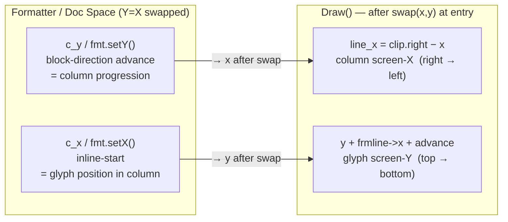
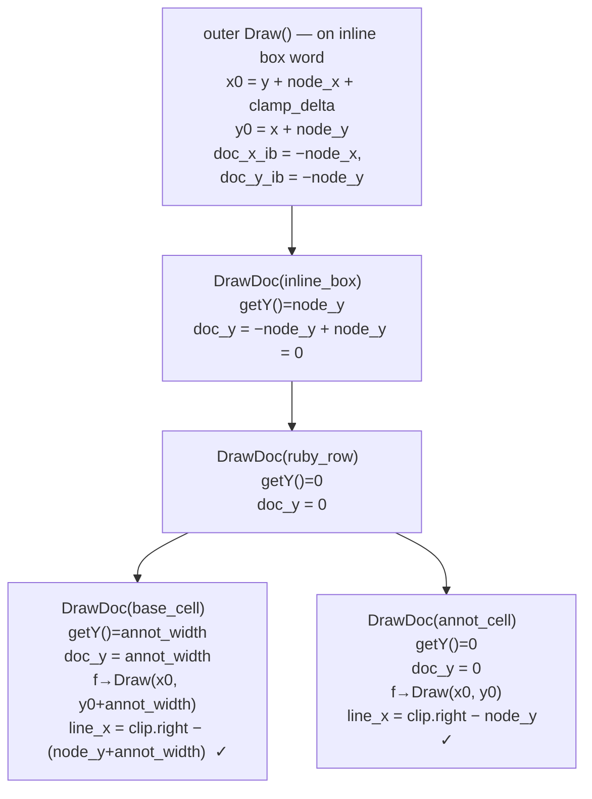

# KOReader Vertical Text (vertical-rl) Implementation

## Soft Fork Policy

This project is a soft fork of koreader/koreader + koreader/koreader-base +
crengine, maintained as m-tky/koreader-tategumi, m-tky/koreader-base, and
m-tky/crengine. Upstreaming is not the goal, but the fork must remain easy
to rebase onto upstream updates. Therefore:

- **Minimal, targeted changes**: Modify only the functions and files necessary
  for the fix. Preserve upstream style, naming conventions, and comment culture.
- **Do not touch upstream code unnecessarily**: Do not clean up commented-out
  debug code or reorganize existing comments — this widens the diff for no gain.
- **No debug code in commits**: Remove all diagnostic `fprintf(stderr, ...)`
  and similar instrumentation before committing.
- **Issues and PRs go to m-tky repos only**: Never open issues or PRs against
  upstream repositories (koreader/koreader, etc.) by mistake.
- **All written communication in English**: Code, comments, commit messages,
  issues, PRs, and documentation must all be written in English.
- **No pixel measurement of screenshots**: Never measure screenshot
  dimensions / bounding boxes via ImageMagick `connected-components` or
  similar.  Always confirm geometry via runtime log diagnostics (fprintf
  to `/tmp/kr_*.log` using `static FILE *F`) instead.  Pixel measurements
  on small low-DPI emulator screenshots are unreliable and have produced
  wrong diagnoses in past sessions.

## Project Goal

Implement Japanese vertical-rl text rendering in KOReader/crengine.
Target: tategumi (縦書き) for Japanese novels in EPUB format.

## Build & Test

```bash
# Build
nix develop --command ./kodev build -d emulator

# Run emulator
nix develop --command ./kodev run emulator

# Run all unit tests
nix develop --command make -j1 testfront

# Run vertical text tests only
nix develop --command ./kodev test front -f "Vertical text"
```

Test fixture: `spec/front/unit/data/fixtures/vertical_text/simple_ja_noruby.epub`

## Architecture: Y=X Coordinate Swap

The core design re-uses the existing horizontal rendering pipeline by swapping X and Y
roles. All rendering stores horizontal column progression in the Y-axis fields so the
page splitter (which splits on Y) naturally splits on columns.

### Coordinate mapping (doc space → screen)

```
doc_y  = page_y + (horizontal offset from right edge)  →  screen_x = page_right - (doc_y - page_y)
doc_x  = vertical pixel position in column             →  screen_y = doc_x
```



### FlowState (lvrend.cpp)

- `c_x` = accumulated horizontal advance (column progression)
- `c_y` = same value as c_x for vertical (advanced in sync in `addContentLine`)
- `l_x`, `l_y` = saved at `newBlockLevel`, both equal at each level entry
- `page_h` is swapped to `page_width` at FlowState constructor for vertical mode
- `context.AddLine(c_x, c_x+height, ...)` feeds horizontal offsets to page splitter

### Block rendering (lvrend.cpp `renderBlockElementEnhanced`)

```cpp
fmt.setX( x );                              // inline-start margin (screen-Y offset)
fmt.setY( flow->getCurrentRelativeY() );   // block-direction advance (screen-X offset)
```

`getCurrentRelativeY() = c_y - l_y == c_x - l_x` in vertical mode.

### CSS Logical Properties (Option C)

`lvlogical.h` provides `CSSLogical` struct mapping CSS physical property array indices
to logical directions for vertical-rl:

```cpp
CSSLogical L(style->writing_mode);
// inline-start = physical top (index 2) for vertical-rl
padding_left = style->padding[L.padIS()];   // padding-top → inline-start
// block-start  = physical right (index 1) for vertical-rl
margin_top   = style->margin[L.marBS()];    // margin-right → block-start
```

This replaces hard-coded physical indices (0,1,2,3) throughout `renderBlockElementEnhanced`
and `DrawDocument`, ensuring CSS padding/margin are applied in the correct directions.

### Formatted text draw (lvtextfm.cpp `LFormattedText::Draw`)

#### Entry and page-level call

`drawPageTo` calls `DrawDocument(buf, root, draw_x0, draw_y0, ...)` with:
- `draw_x0 = clip.top` (screen-Y origin of the text area)
- `draw_y0 = 0` (block-direction origin: "column 0 starts at clip.right")

DrawDocument eventually calls `f->Draw(buf, draw_x0, draw_y0, ...)`.

At Draw() entry, x and y are swapped back to screen coordinates:
```cpp
if (is_vertical) { int tmp = x; x = y; y = tmp; }
// After swap: x = draw_y0 = 0,  y = draw_x0 = clip.top
int line_x = is_vertical ? (clip.right - x) : x;
// line_x = clip.right - 0 = clip.right  (for page-level call)
int line_y = y;  // = clip.top
```

#### Per-column drawing (frmlines)

`line_x` starts at `clip.right` and decreases by `frmline->height` after each frmline.

- Plain column: `frmline->height = strut_height`
- Ruby-inflated column: `frmline->height = strut + annot_width`

#### Plain character positioning

```cpp
x0 = line_x - frmline->height;          // left edge of column
// Center on the column axis:
if (em < strut) x0 += (strut - em) / 2; // (strut - em) / 2 centering
y0 = y + frmline->x + clamped_x;        // screen Y = clip.top + indent + char advance
// Glyph center = x0 + em/2 = line_x - strut/2  ✓
```

#### Inline box (ruby group) draw

`doc_y_ib = −node_y` cancels the inline box's own `getY() = node_y`, so by the time
DrawDocument reaches the ruby cells `doc_y` holds only the cell's own offset.
`x0 = y + node_x + clamp_delta` positions the group's screen-Y start after the preceding
character (clamping prevents overlap with the previous glyph's visual end).



#### Ruby cell column positions (vertical-rl)

For a ruby group with `node_y = N` (= accumulated column advance in block):

| Cell | `cell.getY()` | `inner_line_x` | Glyph center |
|------|--------------|----------------|--------------|
| annotation | 0 | `clip.right − N` | annotation zone |
| base text | `annot_width` | `clip.right − N − annot_width` | base text column |

The base text column is `annot_width` to the left of `clip.right − N` (the annotation zone),
which places it correctly: annotation occupies the inter-column space to the right of the base.

#### Ruby column position

`y0 = x + node_y` and `doc_y_ib = 0 − node_y` ensure each ruby group draws
at the correct accumulated column advance `node_y`, not always at `clip.right − annot_width`.
Regression test: `vertical_ruby_column_spec.lua`.

#### Latin base text column depth

`fmt.getWidth()` after `renderBlockElement` is TTB-based (≈ `char_count × font_size`)
for Latin words rendered as a rotated block. The actual visual column depth is the
horizontal advance of the word. Fix (lvtextfm.cpp `measureText`):

```cpp
// Collect horizontal advance via getCharWidth() during ruby cell scan
base_horiz_advance_pre += base_font->getCharWidth(c);  // per base char
// Override advance with measured value (annotation depth if longer)
advance = max(base_horiz_advance_pre, annot_depth);
```

`o.width` and `letter_spacing` both use this value, so frmline layout and
`vert_min_next_x` tracking in Draw() are both corrected.

Also: `vert_layout_min_x` (post-layout pass) applied `eff_w = max(word->width, font_size)`
to all words including spaces. For a U+0020 before an inline box this inflated
`ib_word_x` by `font_size − space_advance`, creating a gap above the box. Fix
(lvtextfm.cpp `alignLineHorizontal`): apply the font_size minimum only
for CJK words (where compressed punctuation needs it).

```cpp
bool is_cjk = (wi->flags & (LTEXT_WORD_IS_CJK | LTEXT_WORD_IS_FLEXIBLE_WIDTH_CJK)) != 0;
int eff_w = (is_cjk && (int)wi->width < font_sz) ? font_sz : (int)wi->width;
```

### Glyph placement in vertical mode (lvfntman.cpp + lvfntman_vert.{h,cpp})

LuaTeX-ja-conformant vertical typography per JLReq.  Four-stage pipeline:

1. **Pre-shape codepoint substitution** (Phase 5a, lvfntman.cpp measureText + DrawTextString
   buffer-fill loops + lvfntman_vert.cpp `getVertPresentationForm`): in vertical mode,
   U+300C → U+FE41, U+3001 → U+FE11 etc. (~23-entry table ported
   from LuaTeX-ja ltj-jfont.lua:948-957).  Font-conditional via `FT_Get_Char_Index`.
   Only the HarfBuzz buffer sees the substituted codepoint — the caller's text[]
   stays original so JFM class lookup, getRectEx, line-break logic all see the
   ORIGINAL char (mirroring LuaTeX-ja's ltjs.orig_char_table mechanism).
   **Dashes/leaders (U+2014, U+2013, U+2025, U+2026) are DELIBERATELY omitted**
   from this table — LuaTeX-ja nullifies vform entries the font's `vrt2` feature
   already handles (ltj-jfont.lua:1011-1014), so for fonts whose `+vrt2` maps
   —/‥/… to multi-em composite glyphs (Hiragino 二倍ダーシ gid8857 etc.) we let
   `+vrt2` produce the continuous-stroke composite instead of pre-substituting.

2. **Phase 3 — half-em compaction** (lvfntman.cpp measureText + DrawTextString
   advance computation + lvfntman_vert.cpp `getJLReqVertSlotWidth`): override
   HarfBuzz's natural y_advance with the JFM-specified slot width per class:
   open bracket / close bracket / comma / middle dot / period / halfwidth kana
   get em/2; body CJK / dash / exclam / quest / vert mark / Latin stay em.

3. **Phase 5 — inter-class glue/kern matrix** (lvtextfm.cpp measureText loop +
   lvfntman_vert.cpp `getJLReqGlueKernEighths`): apply JLReq inter-class
   spacing per jfm-ujisv [N].glue[M] base values.  e.g. 0.5em is appended
   after CLOSE_BRACKET_COMMA before BODY (= space after 、), 0.5em is
   appended after BODY before OPEN_BRACKET (= space before 「), 0.25em
   around MIDDLE_DOT.  The pad widens the current char's slot; cumulative
   tracker propagates the shift to subsequent chars in the fragment.

4. **Phase 4 — vmtx + cwa in-slot Y** (lvfntman.cpp DrawTextString):
       gx = col_center + vBX
       gy = slot_top  + vBY + cwa
       cwa = align * (fwidth - vadv)  -- align ∈ {0, 0.5, 1}
   Single unified formula for all classes.  For body CJK (align=middle,
   fwidth=em): cwa=0 → pure vmtx-based.  For half-em open bracket
   (align=right): cwa=-em/2 shifts the bitmap to the bottom of the
   compacted slot (visually attaches 「 to the following char).

#### Character classes (lvfntman_vert.{h,cpp}: `getJLReqVertClass`)

Ten classes mirror jfm-ujisv.lua's class table; verified line-by-line against
`luatexja/src/jfm-ujisv.lua`:

| Class                    | Chars                                          | width  | align  |
|--------------------------|------------------------------------------------|--------|--------|
| `CJK_BODY` [0]           | ideographs, hiragana, katakana, Hangul, ー〜～ | em     | middle |
| `OPEN_BRACKET` [1]       | ‘ “ 〈 《 「 『 【 〔 〖 〘 〝 （ ［ ｛ ｟        | em/2  | right  |
| `CLOSE_BRACKET_COMMA` [2]| ’ ” 〉 》 」 』 】 〕 〗 〙 〟 ） ］ ｝ ｠ 、 ，| em/2  | left   |
| `MIDDLE_DOT` [3]         | ・ ： ； ·                                     | em/2  | middle |
| `PERIOD` [4]             | 。 ．                                          | em/2  | left   |
| `DASH` [5]               | — ― ‥ … 〳 〴 〵                                | em     | left   |
| `EXCLAM_QUEST` [6]       | ？ ！ ‼ ⁇ ⁈ ⁉                                  | em     | left   |
| `HALF_KANA` [7]          | U+FF61..U+FF9F (halfwidth katakana)            | em/2  | left   |
| `VERT_MARK`              | — fork-only, signalled by `LFNT_HINT_VERTICAL_MARK` (ー — ‥ … 〜 ～ ―) | em | middle |
| `OTHER`                  | Latin/numerals/etc.                            | em     | middle |

#### Glue/Kern matrix (lvfntman_vert.cpp `getJLReqGlueKernEighths`)

Per-class-pair JLReq inter-character spacing, in eighths of em.  Major entries:

| prev \ next  | BODY | OPEN | CLOSE | MIDDLE | PERIOD | DASH | EXCL | HKANA |
|--------------|------|------|-------|--------|--------|------|------|-------|
| BODY         | 0    | 4    | 0     | 2      | 0      | 0    | 0    | 0     |
| OPEN         | 0    | 0    | 0     | 2      | 0      | 0    | 0    | 0     |
| CLOSE/、     | 4    | 4    | 0     | 2      | 0      | 4    | 4    | 4     |
| MIDDLE       | 2    | 2    | 2     | 4      | 2      | 2    | 2    | 2     |
| PERIOD       | 4    | 4    | 0     | 6      | 0      | 4    | 4    | 4     |
| DASH         | 0    | 4    | 0     | 2      | 0      | 0    | 0    | 0     |
| EXCL         | 8    | 4    | 0     | 6      | 0      | 0    | 0    | 8     |
| HKANA        | 0    | 4    | 0     | 2      | 0      | 0    | 0    | 0     |

(eighths of em — multiply by em / 8 for px)

#### Upstream interaction fixes

Three upstream-side guards needed for our JFM compaction to take effect:

1. `getFlexibleCJKWidthAdjustment` (lvtextfm.cpp:2798) returns wa8=8 (= no
   reduction) in vertical mode.  Without this, upstream's wa8 multiplier
   would further halve our already-half-em advance to em/4 for line-start
   brackets.
2. `vert_layout_min_x` post-pass (lvtextfm.cpp:3680) skips its
   `eff_w = max(word->width, font_size)` clamp when the word's first char
   is a half-em JFM class.  Without this, layout would round word->width
   back up to em.
3. `vert_min_next_x` Draw tracker (lvtextfm.cpp:7454) has the same skip.
   Without this, the Draw renderer would advance the next char by em
   instead of by word->width.

HarfBuzz TTB writes `x_offset = -vertOriginX`, `y_offset = -vertOriginY` into
`glyph_pos[]` (compensation for an LTR-style pen).  The fork places the pen at the
vertical origin directly and reads vBX/vBY from its own cache, so HarfBuzz's offsets
must NOT be added on top — that would double-displace the glyph.

### Coordinate conversion (lvdocview.cpp, cre.cpp)

`windowToDocPoint` (screen → doc):
```cpp
pt.y = page_y + (page_right - screen_x);   // doc_y = horizontal advance
pt.x = screen_y;                            // doc_x = vertical position
```

`docToWindowPoint` (doc → screen):
```cpp
screen_x = page_right - (doc_y - page_y_val);
screen_y = doc_x;
pt.x = screen_x;
pt.y = doc_x;
```

`docToWindowRect` normalizes left/right after conversion (increasing doc_y → decreasing screen_x).
Off-screen rejection: returns false if `screen_x < page_left - 50 || screen_x > page_right + 50`.

`isVerticalText()` heuristic (lvdocview.cpp):
```cpp
bool LVDocView::isVerticalText() const {
    if (m_pages.length() == 0) return false;
    int page_h = m_pages[0]->height;
    return (page_h > 0 && page_h <= m_dx + 32);
}
```

## Implemented Features

### Frontend (Lua)

| Feature | Location |
|---------|----------|
| Text selection: `onHold` uses Lua sboxes for vertical rolling docs | `readerhighlight.lua` |
| Underline highlight: vertical line on right edge of column | `readerview.lua` |
| Strikeout highlight: vertical line through column center | `readerview.lua` |
| Vertical footer: progress bar fills right→left, TOC ticks mirrored | `readerfooter.lua` |
| Glyph rotation: ー 〜 ― etc. use vertical forms (`+vert`, `+vrt2`, `+vkrn` all enabled, matching LuaTeX-ja `auto_enable_vrt2`) or 90° CW rotation when no +vert form. `+vrt2` lets consecutive dashes/leaders (——, ‥, …) chain into one continuous composite glyph | `lvfntman.cpp` |
| Kinsoku (禁則) + cascading 追い出し (oidashi): 行頭/行末 line-break prohibition with a 35-char 行頭禁則 table (closing brackets, 、。, ー々ヽヾゝゞ〻, small kana, ゛゜) and a wrap-back loop (max 5) for chained 」」 / 「「 | `lvtextfm_vert.cpp` `isVertLineStartProhibitedExt` |
| kanjiskip/xkanjiskip vertical justification: 0.25em inserted at CJK↔non-CJK boundaries; LAYOUT (`word->x`) and Draw (`vert_min_next_x`) trackers kept in lockstep | `lvtextfm_vert.cpp` |
| LuaTeX-ja JFM vertical typography (jfm-ujisv.lua port, m-tky/koreader-tategumi#15): 10-class classifier (Phase 1+2), pre-shape codepoint substitution to U+FE10..FE48 (Phase 5a, dashes excluded for +vrt2), half-em compaction for [1][2][3][4][7] (Phase 3), vmtx + cwa in-slot Y (Phase 4), inter-class glue/kern matrix (Phase 5) | `lvfntman.cpp`, `lvfntman_vert.{h,cpp}`, `lvtextfm.cpp`, `lvtextfm_vert.cpp` |
| Multi-em column-break fix: 2+ char ruby boxes, 2em dash composites, and kana-repeat marks break before the column bottom instead of overflowing/clipping (Draw-position check applies to non-CJK multi-em glyphs, not CJK only) | `lvtextfm_vert.cpp` |
| Ruby-following char highlight alignment: LAYOUT inline-box advance uses same `letter_spacing` value as Draw, so the char after a ruby group no longer drifts ½em below its glyph | `lvtextfm_vert.cpp` |
| Column bottom clipping fix: glyphs at column end no longer clipped | `lvtextfm.cpp` |
| sbox screen_y offset (P5): `windowToDocPoint`/`docToWindowPoint` account for `clip.top` | `lvdocview.cpp` |
| Character overlap fix (上にめり込む): `vert_min_next_x` correctly prevents overlap | `lvtextfm.cpp` |

**Note on whitespace**: some EPUBs have U+0020 spaces adjacent to ruby groups (e.g. `と Nachbild《…》 という`). These render as narrow gaps proportional to the space glyph's advance width (≈ ¼ em). This is expected — the space is in the EPUB source.

## Open Issues

### P6 — Per-element writing mode, floats (low priority)

- Mixed horizontal/vertical blocks within one document
- Floats in vertical mode (currently disabled)

## Key File Locations

```
base/                                           crengine submodule
  cre.cpp                                       KOReader↔crengine bridge
  thirdparty/kpvcrlib/crengine/crengine/
    include/lvlogical.h                         CSS logical property index helpers
    include/lvtextfm_fork.h                     Fork-only decls + VerticalDrawState struct
    include/lvfntman_vert.h                     JFM class enum, vert metrics cache decls
    src/lvrend.cpp                              Block rendering, FlowState
    src/lvtextfm_vert.cpp                       Vertical paragraph layout, kinsoku/oidashi/xkanjiskip (fork-only, #included by lvtextfm.cpp)
    src/lvtextfm.cpp                            measureText, ruby inline box
    src/lvfntman_vert.cpp                       JFM class tables, vform, slot width, glyph rotation (fork-only; absorbed former lvfntman_vert_slot.cpp)
    src/lvdocview_vert.cpp                      vertPageRight, isVerticalText (fork-only, #included by lvdocview.cpp)
    src/lvdocview.cpp                           windowToDocPoint, docToWindowPoint
    src/lvfntman.cpp                            HarfBuzz font shaping, +vert/+vrt2/+vkrn features, glyph rotation
    src/lvtinydom.cpp                           DOM, getAbsRect, getRect, getSegmentRects
frontend/document/credocument.lua               Lua wrappers: getWordFromPosition, getTextFromPositions
spec/unit/vertical_text_spec.lua                Formal regression tests
spec/unit/vertical_option_c_spec.lua            Option C: uniform column y_base test
spec/unit/ruby_annot_y_spec.lua                 Ruby cell placement regression
```

## Submodule Chain — commit correspondence

When making C++ changes (crengine), all three repos must be committed and
pushed in order. **The CI fetches each submodule by SHA; if any SHA is not
reachable from the remote's default branch the build will fail.**

```
koreader-tategumi  (github.com/m-tky/koreader-tategumi)
  └─ base          (github.com/m-tky/koreader-base)
       └─ crengine (github.com/m-tky/crengine)
```

### Workflow for crengine changes

Use `scripts/push-chain.sh` to push commits through the chain automatically:

```bash
# Push crengine → base → koreader (full chain)
./scripts/push-chain.sh

# Push from base upward (crengine already pushed)
./scripts/push-chain.sh base

# Push koreader only
./scripts/push-chain.sh koreader

# Preview what would be pushed without doing anything
./scripts/push-chain.sh --dry-run
```

The script handles detached HEAD and diverged branches by cherry-picking onto
`mytky/master`, and automatically fixes stale submodule SHAs (the common failure
mode where a local commit SHA appears in a submodule pointer but was never pushed).

Manual equivalent (if needed):

```bash
# 1. Commit in crengine, push to m-tky/crengine
cd base/thirdparty/kpvcrlib/crengine
git commit -am "..."
git push mytky HEAD:master   # or cherry-pick onto mytky/master if detached

# 2. Update base pointer, push to m-tky/koreader-base
cd ../../..                  # = base/
git add thirdparty/kpvcrlib/crengine
git commit -m "crengine: ..."
git push mytky HEAD:master   # or cherry-pick onto mytky/master if detached

# 3. Update main repo pointer, push, retag
cd ..                        # = koreader/
git add base
git commit -m "base: ..."
git push origin master
git tag -d vYYYY.MM.P && git push origin :refs/tags/vYYYY.MM.P
git tag -a vYYYY.MM.P -m "..." && git push origin vYYYY.MM.P
```

### Pitfall: detached HEAD in base/crengine

Both `base` and `crengine` are often in detached HEAD state.
Commits made in detached HEAD are NOT on any remote branch.
`push-chain.sh` handles this automatically. Manually:

```bash
git checkout mytky/master -b tmp-push
git cherry-pick <sha>
git push mytky tmp-push:master
```

## Test EPUBs

`test/fixtures/vertical_text/sanshiro.epub` (三四郎, Natsume Soseki) — main test EPUB with ruby annotations.
`test/fixtures/vertical_text/simple_ja_noruby.epub` — formal unit tests (no ruby, simpler structure).

`sanshiro.epub` has its own `writing-mode: vertical-rl` CSS; no style tweak needed.
Other EPUBs require: `body { writing-mode: vertical-rl !important; }` via style tweak.
