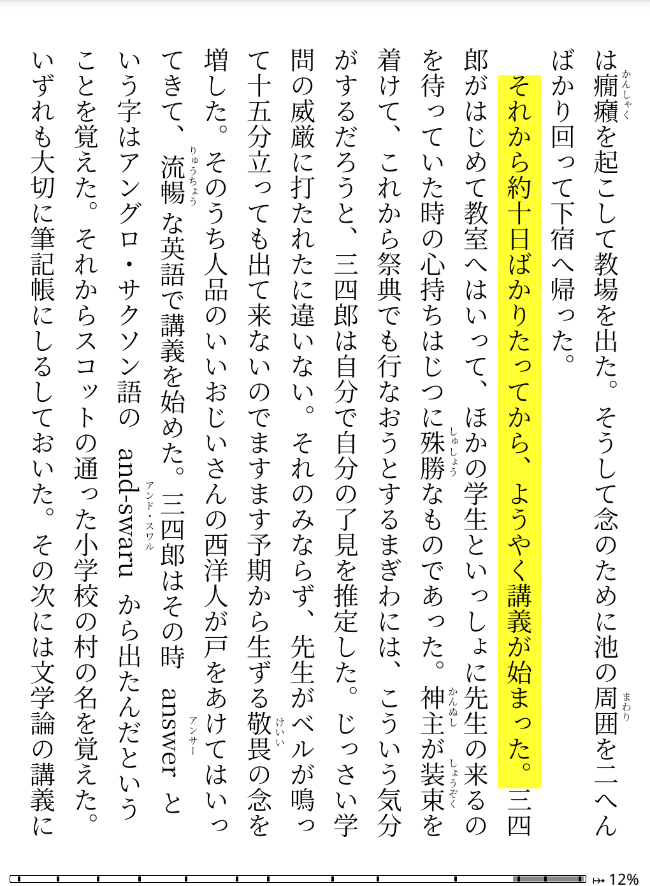

# koreader-tategumi

**KOReader fork with Japanese vertical text (縦書き / tategumi) support.**

This is a personal fork of [KOReader](https://github.com/koreader/koreader) that adds
`writing-mode: vertical-rl` rendering for Japanese novels in EPUB format.
It is regularly synced with upstream KOReader (master / nightly).



## Downloads

Download the build for your device from the
[latest release](https://github.com/m-tky/koreader-tategumi/releases/latest).
Installation steps are the same as upstream KOReader:
[Android](https://github.com/koreader/koreader/wiki/Installation-on-Android-devices) •
[Kindle](https://github.com/koreader/koreader/wiki/Installation-on-Kindle-devices) •
[Kobo](https://github.com/koreader/koreader/wiki/Installation-on-Kobo-devices)

In-app OTA update is supported once installed: **Menu → Update → Check for update**.

### Nightly builds

In addition to tagged releases, a **nightly** build is produced automatically from
the latest `master` every day (around 05:00 JST) for all supported devices. Use it
to get vertical-text fixes and features before they land in a numbered release —
at the cost of less testing, so it may be less stable.

- **Download**: the rolling
  [`nightly` pre-release](https://github.com/m-tky/koreader-tategumi/releases/tag/nightly)
  (labelled `vYYYY.MM.DD`). It is replaced in place by each build, so the link
  always points at the most recent one.
- **OTA**: switch the update channel to development once, then check for updates
  as usual: **Menu → Update → Settings → Update channel → Development**, then
  **Menu → Update → Check for update**. Switch back to **Stable** to return to
  numbered releases.

## Using vertical text

EPUBs that already contain `writing-mode: vertical-rl` in their CSS (most commercial
Japanese novels do) render vertically automatically.

For EPUBs that do not include this CSS, add the following via
**Typeset (Aa icon) → Style tweaks → Book-specific tweak** (long-press to edit):

```css
body { writing-mode: vertical-rl !important; }
```

## RTL page order (漫画・右開き)

Japanese manga EPUBs and CBZ/CBR files with right-to-left page order are detected
automatically when you open them for the first time:

- **EPUB**: reads `page-progression-direction="rtl"` from the OPF spine
- **CBZ/CBR**: reads `<ReadingDirection>RTL</ReadingDirection>` from `ComicInfo.xml`

When RTL is detected a notification appears, the page-turn direction is reversed,
and the progress bar fills from right (page 1) to left (last page).

You can always override the detected direction via
**Menu → Taps & gestures → Page turns → Switch page-turn direction**.
The override is saved per-book and will not be overwritten on subsequent opens.

## Known limitations

- **Mixed horizontal/vertical layouts**: A single document renders entirely in one
  writing mode. EPUBs that mix horizontal and vertical sections within the same file
  may not display correctly.

- **Whitespace between ruby groups**: EPUBs with stray whitespace adjacent to ruby
  groups may show a small gap between the ruby and the following character. This is
  a property of the EPUB source, not a rendering bug.

- **Double paragraph indent**: Some EPUBs use a U+3000 ideographic space (`　`) for
  indentation while CREngine also applies its default `text-indent: 1.2em`, producing
  a two-character indent. Fix per-book via **Aa → Style tweaks → Paragraph first-line
  indentation → 0** (no indent).

## Compatibility

This fork tracks upstream KOReader master, so its base is equivalent to upstream
**nightly**, not the stable release. If a third-party plugin does not work, please
verify it also fails with vanilla upstream KOReader nightly before filing an issue
here — plugin breakage that also occurs upstream is out of scope for this fork.

### Plugins with vertical-rl support

The following plugins have soft-forks tuned for this fork's vertical-rl mode:

- **Bookends** ([m-tky/bookends.koplugin](https://github.com/m-tky/bookends.koplugin)) —
  configurable text overlays. Forked from
  [AndyHazz/bookends.koplugin](https://github.com/AndyHazz/bookends.koplugin) with
  vertical-rl auto-detection so progress bars fill right→left in tategumi documents.

## Advanced: switching from vanilla KOReader

If you already have vanilla KOReader installed, you can switch to this fork without
reinstalling from scratch:

1. Copy `frontend/ui/otamanager.lua` from this repository into
   `<koreader-dir>/frontend/ui/otamanager.lua` on your device.
2. Restart KOReader and go to **Menu → Update → Check for update**.
3. KOReader will download and apply this fork's build automatically.

## Support

If you find this vertical text fork useful, you can support its development:

[](https://github.com/sponsors/m-tky)

For the upstream KOReader project itself, please see
[koreader/koreader](https://github.com/koreader/koreader).

## Acknowledgements

KOReader is an open-source e-book reader for e-ink devices, developed by volunteers
around the world. The vertical text (tategumi) implementation in this fork is built
on their work. See [upstream KOReader](https://github.com/koreader/koreader) for the
project's main features, supported formats, and developer documentation.

[](https://github.com/m-tky/koreader-tategumi/commits/master)
[](https://github.com/koreader/koreader/blob/master/COPYING)
